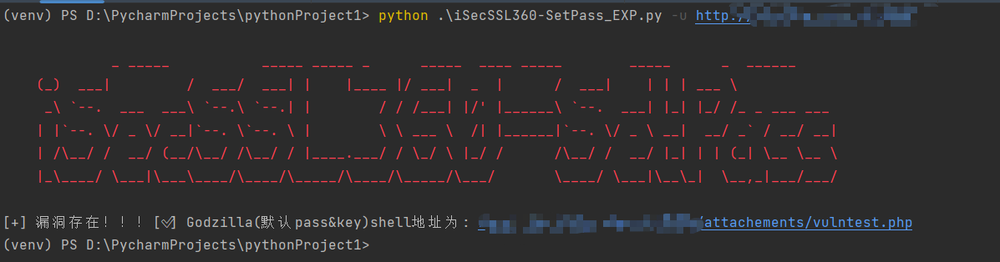
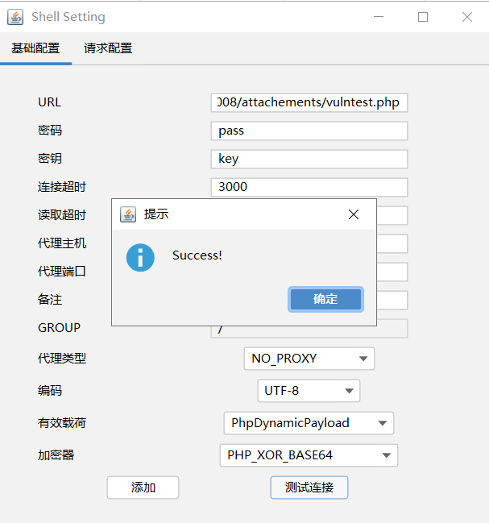

# iSecSSL360-SetPass_POC
网神 SecGate 3600 防火墙 obj_app_upfile接口存在任意文件上传漏洞验证脚本

产品简介
   
   网神SecGate3600下一代极速防火墙（NSG系列）是基于完全自主研发、经受市场检验的成熟稳定网神第三代SecOS操作系统 并且在专业防火墙、VPN、IPS的多年产品经验积累基础上精心研发的高性能下一代防火墙 专门为运营商、政府、军队、教育、大型企业、中小型企业的互联网出口打造的集防火墙、抗DDoS攻击、VPN、内容过滤、IPS、带宽管理、用户认证等多项安全技术于一身的主动防御智能安全网关。

漏洞概述

  网神 SecGate 3600 防火墙  obj_app_upfile 接口存在任意文件上传漏洞，未经授权的攻击者通过漏洞可以上传任意文件，获取服务器权限。

影响范围

  网神 SecGate 3600 防火墙

复现环境

FOFA：fid="1Lh1LHi6yfkhiO83I59AYg=="

### poc

```
usage: iSecSSL360-SetPass_POC.py [-h] [-u URL] [-f FILE] [-t THREAD] [-T TIMEOUT] [-o OUTPUT] [-p PROXY]

optional arguments:
  -h, --help            show this help message and exit
  -u URL, --url URL     Target url(e.g. http://127.0.0.1)
  -f FILE, --file FILE  Target file(e.g. url.txt)
  -t THREAD, --thread THREAD
                        Number of thread (default 5)
  -T TIMEOUT, --timeout TIMEOUT
                        Request timeout (default 3)
  -o OUTPUT, --output OUTPUT
                        Vuln url output file (e.g. result.txt)
  -p PROXY, --proxy PROXY
                        Request Proxy (e.g http://127.0.0.1:8080)
```

```
python '.iSecSSL360-SetPass_POC.py' -f .\url.txt -t 10
```

### exp

```
usage: iSecSSL360-SetPass_EXP.py [-h] [-u URL] [-T TIMEOUT] [-p PROXY]

optional arguments:
  -h, --help            show this help message and exit
  -u URL, --url URL     Target url(e.g. url.txt)
  -T TIMEOUT, --timeout TIMEOUT
                        Request timeout (default 3)
  -p PROXY, --proxy PROXY
                        Request Proxy (e.g http://127.0.0.1:8080)
```

```
python '.\iSecSSL360-SetPass_EXP.py' -u http://127.0.0.1
```



一键上传后通过哥斯拉连接



## 免责声明

由于传播、利用此文所提供的信息而造成的任何直接或者间接的后果及损失，**均由使用者本人负责，作者不为此承担任何责任**。
